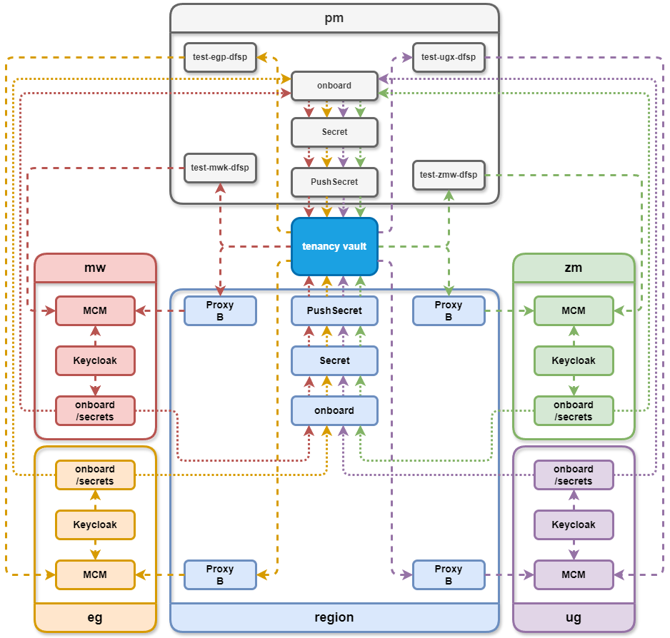

# Onboarding Service

This service is responsible for managing the onboarding process for DFSPs
(Digital Financial Service Providers) and handling secrets in a Kubernetes
environment. It interacts with Keycloak for authentication and authorization,
and Kubernetes for managing secrets.

## Features

1. **Secrets Management**:

   Fetches secrets from a remote Keycloak and stores them in Kubernetes as
   Secrets and PushSecrets.

   For example the service running in each `emulated` environment will provide
   the secrets to the `region` environment so that the proxy can generate a
   CSR and send it to the `emulated` MCM.

2. **Onboarding Process**:

   Automates the onboarding of DFSPs by interacting with the MCM API. For this
   to work a client is created in Keycloak and the `mcmadmin` role is assigned
   to the client. Then a token is obtained for this client and used to call
   MCM for signing the CSR and then triggering the onboarding process.

3. **Health and Monitoring**:

   Provides a `/health` endpoint to check the service's health and
   logs all operations for monitoring and debugging.

## Configuration

The service supports the following configuration parameters:

- **Keycloak**:
  - `keycloak.baseUrl`: The base URL of the Keycloak server.
     By default it is obtained from the VirtualService `keycloak-admin-vs`.
  - `keycloak.realmName`: The realm to authenticate against. The default is `master`.
  - `keycloak.username`: Username for Keycloak authentication.
     By default it is obtained from the secret `switch-keycloak-initial-admin`.
  - `keycloak.password`: Password for Keycloak authentication.
     By default it is obtained from the secret `switch-keycloak-initial-admin`.

- **Kubernetes**:
  - `k8s.loadFromCluster`: Whether to load Kubernetes configuration from the cluster.

- **HTTP**:
  - `http.auth`: Authorization token for accessing the `/secrets` endpoint
  - `http.port`: The port on which the service runs.

- **Environment**:
  - `env`: The environment name (e.g., `region-dev`, `eg-uat`).

- **Secrets**:
  - `secrets`: Map of URLs per environment for obtaining the secrets,
     for example:

     ```json
       {
           "region": {
               "https://onboard.eg-example.com/secrets": {
                   "proxy-egp": "region${suffix}/proxy-egp/mcm_client_secret_b"
               },
               "https://onboard.zm-example.com/secrets": {
                   "proxy-zmw": "region${suffix}/proxy-zmw/mcm_client_secret_b"
               }
           }
       }
     ```

     Under each URL is a map for specifying the Vault destination for each obtained
     secret.

- **DFSP**:
  - `dfsps`: List of DFSPs to onboard per environment, for example:

    ```json
    "dfsps": {
        "region": [
            "test-fxp",
            "proxy-egp"
        ]
    }
    ```

## Endpoints

1. **Secrets Endpoint**:
   - `GET /secrets`: Fetches secrets from Keycloak and returns them as a JSON response.

2. **Health Endpoint**:
   - `GET /health`: Returns the health status of the service.

## Deployment

The onboarding service is designed to run in a Kubernetes environment and
requires a proper service account with RBAC permissions for the Secrets,
VirtualServices and PushSecrets.

## Architecture


