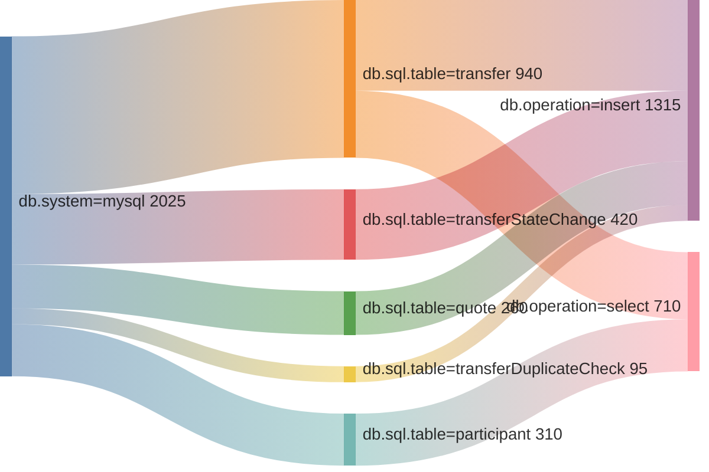

# `GET /traces` — Trace Span Aggregation Handler

Fetches traces from **Grafana Tempo**, extracts individual spans, and computes
duration statistics grouped by any combination of span or resource attributes.
Results are available as JSON or as a self-contained HTML page that includes a
**Sankey diagram** showing how time flows across attribute layers.

---

## Use Cases

- How much total DB time does one transaction type spend per table and operation?
- Which Kafka topics consume the most time in a message-processing trace?
- Which service + HTTP route combinations have the highest p95 latency?

---

## Query Parameters

| Parameter | Required | Default | Description |
|---|---|---|---|
| `groupBy` | ✅ | — | Comma-separated span/resource attribute keys to group by, e.g. `db.sql.table,db.operation` |
| `q` | | `{}` | TraceQL query to select traces, e.g. `{span.db.system="mysql"}` |
| `spanFilter` | | `{}` | JSON object to filter which spans are included after fetch. Supports exact match or `{"min":N,"max":N}` numeric ranges. E.g. `{"db.system":"mysql"}` |
| `aggregation` | | `avg` | Comma-separated list: `avg`, `total`, `min`, `max`, `p50`, `p95`, `p99` |
| `since` | | — | Relative time window: `1h`, `30m`, `2d`, etc. |
| `start` / `end` | | — | Unix epoch seconds (alternative to `since`) |
| `limit` | | `20` | Max number of traces to fetch from Tempo |
| `format` | | `json` | `json` or `html` |

---

## Examples

### DB time per table and operation type (last hour, HTML)

```
GET /traces?groupBy=db.sql.table,db.operation&spanFilter={"db.system":"mysql"}&aggregation=avg,total,p95&since=1h&format=html
```

### Kafka topic latency breakdown (last 30 minutes, JSON)

```
GET /traces?q={span.messaging.system="kafka"}&groupBy=messaging.destination.name,messaging.operation.name&aggregation=avg,p99&since=30m
```

### HTTP route performance per service (last 2 hours, HTML)

```
GET /traces?groupBy=k8s.deployment.name,http.route&spanFilter={"http.method":"POST"}&aggregation=avg,p95,total&since=2h&format=html
```

---

## JSON Response Shape

```json
{
  "traces": 18,
  "matchingSpans": 342,
  "sankeyLinks": [
    ["db.system=mysql", "db.sql.table=transfer", 1820.5],
    ["db.sql.table=transfer", "db.operation=insert", 940.2]
  ],
  "rows": [
    {
      "group": "transfer | insert",
      "attrs": { "db.sql.table": "transfer", "db.operation": "insert" },
      "count": 54,
      "avgDurationMs": 17.4,
      "totalDurationMs": 940.2,
      "p95DurationMs": 38.1
    }
  ]
}
```

---

## How It Works

```
Tempo /api/search  ──►  matching traceIDs
        │
        ▼  (fetch each trace, 5 concurrent)
Tempo /api/traces/{id}
        │
        ▼
  Flatten all spans from all batches
        │
        ▼
  Apply spanFilter  (exact or range match on any attribute)
        │
        ▼
  Group by groupBy keys  ──►  compute aggregations per group
        │
        ▼
  buildSankeyLinks  ──►  sum duration per adjacent-key pair
        │
        ▼
  JSON response  or  HTML with table + Sankey diagram
```

---

## HTML Output — Sankey Diagram

When `format=html` is used and `groupBy` contains two or more keys, the page
renders an interactive Sankey diagram (via Google Charts) above the breakdown
table. The width of each flow is proportional to the **total milliseconds**
accumulated on that edge. Nodes are coloured by layer (one colour per `groupBy`
level). The diagram is responsive and redraws on window resize.

The diagram below illustrates the kind of output produced for a three-level
`db.system → db.sql.table → db.operation` grouping:



Each edge value is **total milliseconds** accumulated across all matching spans
in the fetched traces. A wide flow means that combination of attributes accounts
for a large share of overall duration — making hotspots immediately visible.

---

## Configuration

Add `tempo.url` to your `.devrc` or environment:

```ini
# .devrc
tempo__url=http://tempo-gateway.monitoring.svc.cluster.local:80
```

Or as an environment variable:

```sh
export dev_tempo__url=http://tempo-gateway.monitoring.svc.cluster.local:80
```
